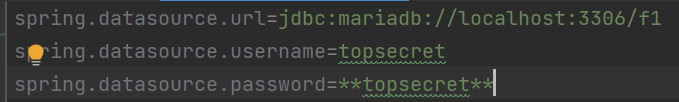

# F1 Records

This is an F1 APi where you can find any information related to formula 1. You can find information For example, you can get 
information about the lap time of Fernando Alonso at the Spanish Grand Prix in 2022, see the standings of X Grand Prix, 
see the stops of Y driver and many other things. To know the accessible endpoints you only have to run the API and go 
to /api/ui , once there you will see a Swagger where you can graphically see all the available options.

## How to configure DB
You can get the tables used on this [website](http://ergast.com/mrd/db/#csv), I got it from this website as well. 
Another option available is to go to my repository inside the SQLs folder and inside you will find a sql file with all the creation scripts. 
In my case I have used MariaDB as DB manager. Once this is done, the only thing left to do is to configure the .properties of the Spring boot application. How is this done? Easy, we go to our .properties, located in the resources folder, open the file and edit the following lines.
NOTE: f1 is my own name of the database, you have to put the one you have put previously.

  

## Authors

- [@AitorSotoJimenez on LinkedIn](https://www.linkedin.com/in/aitorsotojimenez/)
- [@AitrollSr on GitHub](https://github.com/AitrollSr)

## Acknowledgements

 - [Ergast Developer API](http://ergast.com/mrd/db/#csv)

## License

[MIT](https://choosealicense.com/licenses/mit/)

